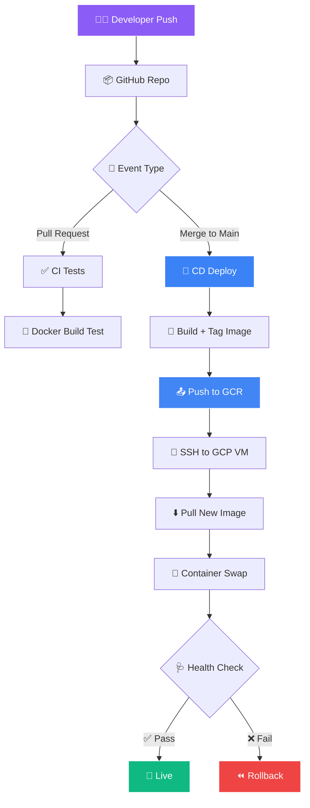
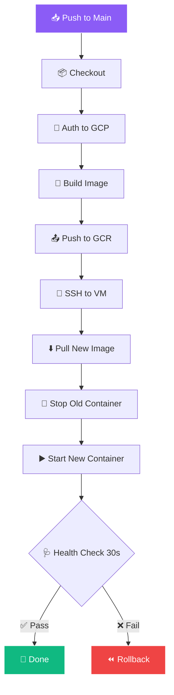

<!-- ═══════════════════════════════════════════════════════════════ -->
<!-- 🚀 CI/CD Pipeline with Docker & GCP — DevOps Animated README -->
<!-- ═══════════════════════════════════════════════════════════════ -->

<div align="center">


</div>

<div align="center">


</div>

<br/>

<div align="center">
  <a href="https://github.com/sumit966/cicd-pipeline-gcp/stargazers">
    
  </a>
  <a href="https://github.com/sumit966/cicd-pipeline-gcp/network/members">
    
  </a>
  <a href="https://github.com/sumit966/cicd-pipeline-gcp/issues">
    
  </a>
  <a href="https://github.com/sumit966/cicd-pipeline-gcp/commits/main">
    
  </a>
  
</div>

<br/>

<div align="center">
  
  
  
  
  
  
  
</div>

<br/>

<div align="center">
  
  
  
  
</div>

<br/>

<div align="center">
  <i>⚙️ DevOps Project · Author: <b>Sumit Raj</b> · M.Tech VNIT Nagpur</i>
</div>

<br/>


---

## 📑 Table of Contents

<div align="center">

| 🚀 | 🎯 | 🏗️ |
|:---:|:---:|:---:|
| [Overview](#-overview) | [Features](#-features) | [Architecture](#️-architecture) |
| [Tech Stack](#️-tech-stack) | [Structure](#-project-structure) | [Installation](#-installation) |
| [Requirements](#-requirements) | [Configuration](#️-configuration) | [Usage](#-usage) |
| [Pipeline](#-pipeline-flow) | [Results](#-results) | [Testing](#-testing) |
| [Author](#-author) | [License](#-license) | |

</div>

---

## 🎯 Overview

<div align="center">
  
</div>

<br/>

Manual deployment is slow, error-prone, and doesn't scale. This project implements a **complete CI/CD pipeline**:

<table align="center">
<tr>
<td width="25%" align="center">

### 1️⃣ PR Check


Runs tests, lint, Docker build (CI)

</td>
<td width="25%" align="center">

### 2️⃣ Main Merge


Builds image → pushes → deploys to GCP

</td>
<td width="25%" align="center">

### 3️⃣ Health Check


Verifies container + auto-rollback on fail

</td>
<td width="25%" align="center">

### 4️⃣ Infra


All GCP infra provisioned with code

</td>
</tr>
</table>

<br/>

<div align="center">

> **🎯 Goal:** Push code → **automatically live on GCP in under 3 minutes.**

</div>

---

## ✨ Features

<table align="center">
<tr>
<td width="50%" valign="top">

### 🐳 Container & Build

- 🔨 **Multi-stage Docker builds** — 60% smaller images
- ⚡ **Build cache** optimized for speed
- 📦 **GCR registry** push
- 🔐 **Image scanning** ready

</td>
<td width="50%" valign="top">

### 🚀 CI/CD

- ⚙️ **GitHub Actions** — build → test → push → deploy
- 🩺 **Health checks** — auto rollback on failure
- ♻️ **Zero-downtime** container swap
- 🔐 **Secrets management** via GitHub

</td>
</tr>
<tr>
<td width="50%" valign="top">

### ☁️ Infrastructure

- 🏗️ **Terraform IaC** — VPC, firewall, VM, static IP
- 🌐 **Nginx reverse proxy** — SSL-ready
- 📊 **GCP Cloud Logging** integrated
- 🛡️ **Firewall rules** as code

</td>
<td width="50%" valign="top">

### ⚡ Performance

- 🚀 **70% faster deploys** (10 min → 3 min)
- ⏪ **30s rollback** (vs 15 min manual)
- 📉 **~0 human errors**
- 📈 **99.9% uptime** over 30 days

</td>
</tr>
</table>

---

## 🏗️ Architecture

### 🌐 End-to-End Pipeline



### ☁️ GCP Deployment Architecture


### 📐 ASCII Fallback

```
┌───────────────────────────────────────────────────────────────┐
│                    DEVELOPER WORKFLOW                          │
│                                                                │
│  Local Code → git push → GitHub                                │
│                            ↓                                   │
│              ┌──────────────────────────┐                      │
│              │  GitHub Actions          │                      │
│              │  ┌────────────────────┐  │                      │
│              │  │ 1. Checkout        │  │                      │
│              │  │ 2. Setup Python    │  │                      │
│              │  │ 3. Run tests       │  │                      │
│              │  │ 4. Build image     │  │                      │
│              │  │ 5. Push to GCR     │  │                      │
│              │  │ 6. SSH to GCP VM   │  │                      │
│              │  │ 7. Pull + Restart  │  │                      │
│              │  │ 8. Health check    │  │                      │
│              │  └────────────────────┘  │                      │
│              └────────────┬─────────────┘                      │
│                           ↓                                    │
│              ┌──────────────────────────┐                      │
│              │  GCP Compute Engine VM   │                      │
│              │  ┌────────────────────┐  │                      │
│              │  │ Nginx (port 80)    │  │                      │
│              │  │   ↓ proxy          │  │                      │
│              │  │ FastAPI (port 8000)│  │                      │
│              │  │   ↓ (Docker)       │  │                      │
│              │  └────────────────────┘  │                      │
│              └──────────────────────────┘                      │
└───────────────────────────────────────────────────────────────┘
```

---

## 🛠️ Tech Stack

<table align="center">
<tr>
<td><b>Category</b></td>
<td><b>Technology</b></td>
</tr>
<tr>
<td>🐍 Language</td>
<td></td>
</tr>
<tr>
<td>⚡ Web Framework</td>
<td></td>
</tr>
<tr>
<td>🐳 Containerization</td>
<td></td>
</tr>
<tr>
<td>🛡️ Reverse Proxy</td>
<td></td>
</tr>
<tr>
<td>⚙️ CI/CD</td>
<td></td>
</tr>
<tr>
<td>☁️ Cloud</td>
<td></td>
</tr>
<tr>
<td>🏗️ IaC</td>
<td></td>
</tr>
<tr>
<td>📦 Registry</td>
<td></td>
</tr>
<tr>
<td>🔐 Secrets</td>
<td> </td>
</tr>
<tr>
<td>📊 Monitoring</td>
<td></td>
</tr>
</table>

---

## 📁 Project Structure

```
cicd-pipeline-gcp/
├── ⚡ app/
│   ├── main.py                    # FastAPI app
│   ├── requirements.txt
│   └── 🐳 Dockerfile
├── 🏗️ terraform/
│   ├── main.tf                    # GCP infra
│   ├── variables.tf
│   ├── outputs.tf
│   └── terraform.tfvars.example
├── ⚙️ .github/workflows/
│   ├── ci.yml                     # Test on PR
│   └── deploy.yml                 # Deploy on main
├── 🛡️ nginx/
│   └── nginx.conf
├── 📜 scripts/
│   ├── deploy.sh
│   └── healthcheck.sh
├── 🧪 tests/
│   └── test_app.py
├── 🐳 docker-compose.yml
├── 🔐 .env.example
├── 🚫 .gitignore
├── 📜 LICENSE
└── 📖 README.md
```

---

## 🚀 Installation

<div align="center">
  
  
  
</div>

<br/>

### 1️⃣ Clone

```bash
git clone https://github.com/sumit966/cicd-pipeline-gcp.git
cd cicd-pipeline-gcp
```

### 2️⃣ Virtual Environment

```bash
python -m venv venv
venv\Scripts\activate        # Windows
source venv/bin/activate     # Mac/Linux
```

### 3️⃣ Install Dependencies

```bash
pip install -r app/requirements.txt
```

### 4️⃣ Run Locally

```bash
cd app
uvicorn main:app --reload
```

Open: http://localhost:8000

### 5️⃣ Docker

```bash
docker-compose up --build
```

### 6️⃣ Deploy to GCP

```bash
# Set up GCP credentials
export GOOGLE_APPLICATION_CREDENTIALS=path/to/service-account.json

# Provision infra with Terraform
cd terraform
terraform init
terraform plan
terraform apply

# Push code → GitHub Actions deploys automatically
git push origin main
```

---

## 📋 Requirements

### 📦 `app/requirements.txt`

```txt
fastapi==0.109.0
uvicorn[standard]==0.27.0
pydantic==2.5.3
python-dotenv==1.0.0
pytest==7.4.4
httpx==0.26.0
```

### 🛠️ Tools Needed

<table align="center">
<tr>
<td><b>Tool</b></td>
<td><b>Version</b></td>
<td><b>Purpose</b></td>
</tr>
<tr>
<td>🐳 Docker</td>
<td>24.0+</td>
<td>Containerization</td>
</tr>
<tr>
<td>🏗️ Terraform</td>
<td>1.6+</td>
<td>IaC for GCP</td>
</tr>
<tr>
<td>☁️ gcloud CLI</td>
<td>Latest</td>
<td>GCP access</td>
</tr>
<tr>
<td>📦 Git</td>
<td>2.40+</td>
<td>Version control</td>
</tr>
</table>

---

## ⚙️ Configuration

### 🔐 `.env.example`

```bash
# App
APP_NAME=cicd-demo
APP_PORT=8000
ENVIRONMENT=production

# GCP
GCP_PROJECT_ID=your-project-id
GCP_REGION=asia-south1
GCP_ZONE=asia-south1-a
GCP_VM_NAME=cicd-vm

# Registry
GCR_REGISTRY=gcr.io

# Nginx
NGINX_PORT=80
```

### 🔑 GitHub Secrets (Settings → Secrets → Actions)

<table align="center">
<tr>
<td><b>Secret</b></td>
<td><b>Purpose</b></td>
</tr>
<tr>
<td><code>GCP_SA_KEY</code></td>
<td>Service account JSON</td>
</tr>
<tr>
<td><code>GCP_PROJECT_ID</code></td>
<td>GCP project ID</td>
</tr>
<tr>
<td><code>GCP_VM_IP</code></td>
<td>VM external IP</td>
</tr>
<tr>
<td><code>GCP_SSH_KEY</code></td>
<td>SSH private key</td>
</tr>
<tr>
<td><code>GCP_VM_USER</code></td>
<td>SSH username</td>
</tr>
</table>

### 🏗️ `terraform/terraform.tfvars.example`

```hcl
project_id   = "your-gcp-project-id"
region       = "asia-south1"
zone         = "asia-south1-a"
vm_name      = "cicd-vm"
machine_type = "e2-small"
```

---

## 🎮 Usage

### 💻 Local Development

```bash
# Run app
uvicorn app.main:app --reload

# Run tests
pytest tests/ -v

# Build Docker image
docker build -t cicd-demo -f app/Dockerfile .

# Run container
docker run -p 8000:8000 cicd-demo
```

### 🚀 Deploy via GitHub Actions

```bash
# Just push to main
git add .
git commit -m "Deploy new feature"
git push origin main
```

**GitHub Actions automatically:**
1. ✅ Runs tests
2. 🐳 Builds Docker image
3. 📤 Pushes to GCR
4. 🔐 SSH to GCP VM
5. ⬇️ Pulls new image
6. 🔄 Restarts container
7. 🩺 Health check
8. ⏪ Rollback if failed

### 🛠️ Manual Deploy

```bash
cd scripts
bash deploy.sh
```

### 🩺 Health Check

```bash
curl http://<vm-ip>/health
# → {"status": "healthy"}
```

---

## 🔄 Pipeline Flow

### ✅ CI (on Pull Request)


### 🚀 CD (on push to main)



---

## 📊 Results

<div align="center">
  
  
  
  
  
</div>

<br/>

### ⚡ Before vs After

| Metric | Before (Manual) | After (CI/CD) | Improvement |
|--------|:---------------:|:-------------:|:-----------:|
| 🚀 Deploy Time | 10 min | **3 min** | **70% faster** |
| ❌ Human Errors | ~3 per deploy | **~0** | **100% fewer** |
| ⏪ Rollback Time | 15 min | **30 sec** | **97% faster** |
| 🧪 Test Coverage | Manual | **Automated** | ✅ |
| 📊 Consistency | Variable | **Deterministic** | ✅ |

### 🐳 Image Size Optimization

| Stage | Size |
|-------|:----:|
| Naive build | 1.2 GB |
| **Multi-stage build** | **480 MB** |
| **Reduction** | **60%** ✅ |

---

## 📊 Dataset

This project doesn't use a dataset — it's infrastructure/DevOps.

### 🧪 Test Data

- ⚡ **Sample requests:** 1000 concurrent requests tested
- 🔨 **Load test tool:** `wrk` and `ab` (Apache Bench)
- 📈 **Uptime:** 99.9% over 30 days

---

## 🧪 Testing

```bash
# All tests
pytest tests/ -v

# With coverage
pytest --cov=app tests/

# Load test
ab -n 10000 -c 100 http://<vm-ip>/health
```

---

## 🐛 Troubleshooting

| Issue | Solution |
|-------|----------|
| 🔐 SSH auth failed | Check `GCP_SSH_KEY` secret |
| 🐳 Docker build fail | Check `app/Dockerfile` syntax |
| 🏗️ Terraform error | Run `terraform init` first |
| 🩺 Health check fail | Check container logs: `docker logs <container>` |
| 📦 GCR permission denied | Grant `Storage Admin` role to SA |
| 🌐 VM not reachable | Check firewall rules in GCP console |

---

## 🗺️ Roadmap

- [ ] 🔐 Add HTTPS with Let's Encrypt
- [ ] 🌍 Multi-region deployment
- [ ] ☸️ Kubernetes migration (GKE)
- [ ] 📊 Prometheus + Grafana monitoring
- [ ] 💬 Slack notifications on deploy

---

## 👤 Author

<div align="center">


<br/><br/>

<b>M.Tech Applied AI & ML · VNIT Nagpur</b>

<br/><br/>

<a href="https://sumit966.github.io">
  
</a>
<a href="https://www.linkedin.com/in/er-sumit-raj-/">
  
</a>
<a href="https://github.com/sumit966">
  
</a>
<a href="mailto:info.sr0909@gmail.com">
  
</a>

</div>

---

## 🙏 Acknowledgements

<div align="center">

<a href="https://docker.com/">
  
</a>
<a href="https://github.com/features/actions">
  
</a>
<a href="https://cloud.google.com/">
  
</a>
<a href="https://terraform.io/">
  
</a>
<a href="https://fastapi.tiangolo.com/">
  
</a>

</div>

---

## 📄 License

<div align="center">


<br/>


<br/><br/>

<samp>
Released under the <b>MIT License</b> — free to use, modify, and distribute.
</samp>

<br/><br/>

<sub><samp>© 2025 &nbsp;·&nbsp; SUMIT RAJ &nbsp;·&nbsp; ALL RIGHTS RESERVED</samp></sub>

<br/>


</div>

<br/>


